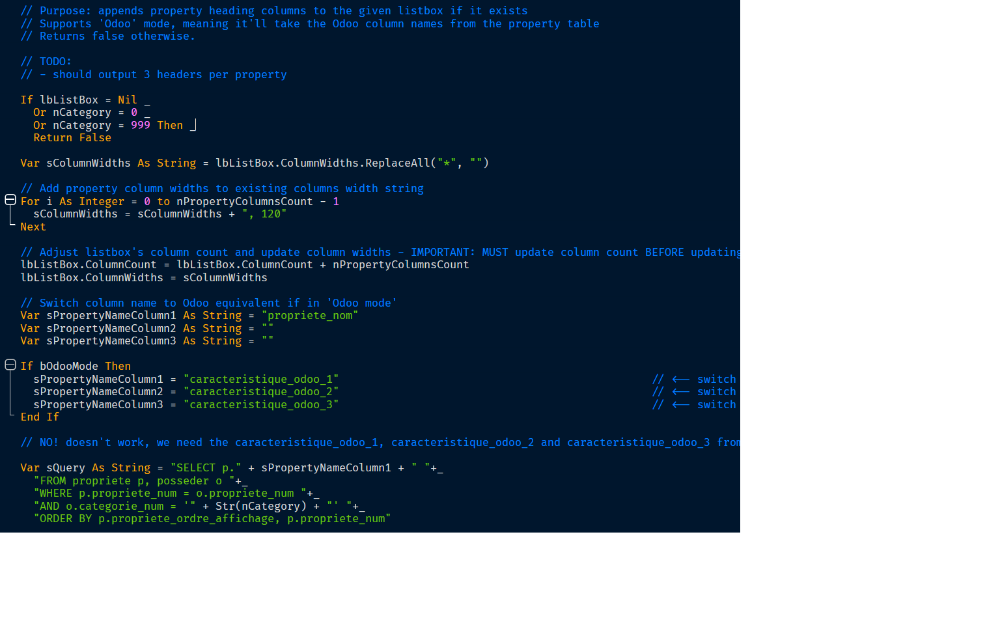
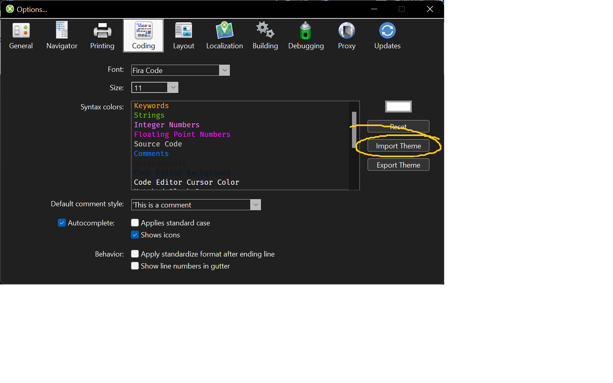

# Cobalt 2 Theme for Xojo
A Cobalt 2 theme for Xojo's code editor. Best combined with Fira Code, Input or Hack fonts.

## Screenshot

## Installation
Import the theme from Xojo's Options dialog:

## License
Cobalt 2 for Xojo is free software; see [LICENSE](https://github.com/DexterLagan/Cobalt-Theme-for-Xojo/blob/main/LICENSE) for more details.
